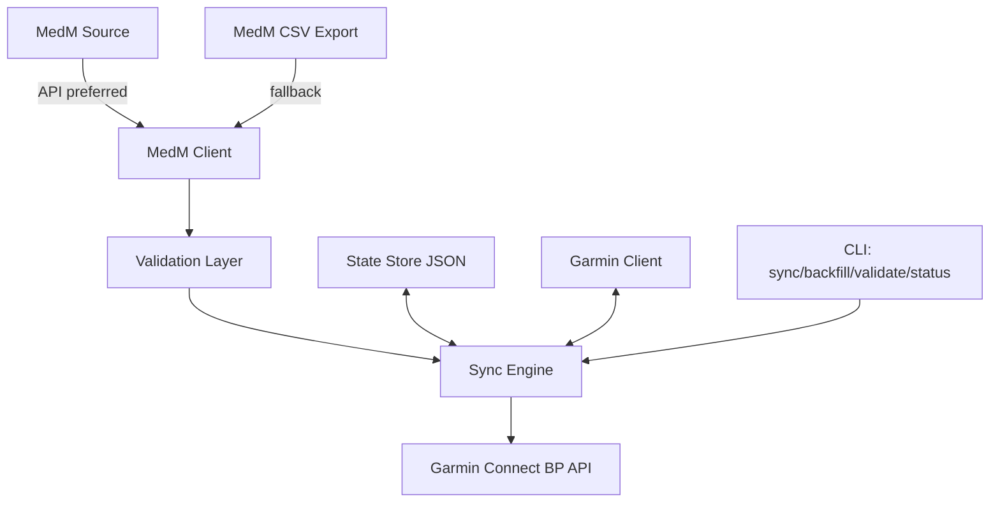

# Architecture

## Assumptions and uncertain API behavior

- MedM official API availability and schema can vary per account/app region.
- This implementation assumes a `GET /measurements` endpoint returning either:
  - a top-level list of measurement objects, or
  - an object containing a `measurements` list.
- Timestamp and key names are normalized with common variants (`timestamp`, `measurement_time`, etc.).
- If API retrieval fails, CSV fallback is used when configured.
- Garmin upload relies on the Python `garminconnect` client behavior (`set_blood_pressure`, `get_blood_pressure`) as observed in existing open-source tools.
